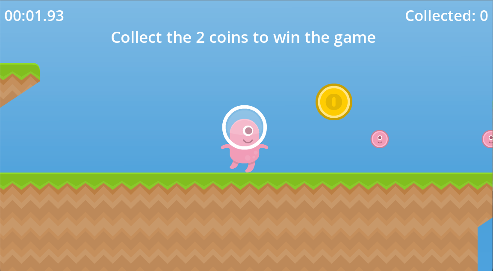

# Atelier Introduction Godot

Projet pour l'atelier d'introduction à Godot. Sur la branche: `starter` il y a le projet de base avec les assets déjà importés et le tilemap configuré. 

Pour visualiser le projet final, veuillez vous rendre sur la branche `end`.

## Assets

- [Platformer Art Pixel Redux by Kenney](https://kenney.nl/assets/platformer-art-pixel-redux)
